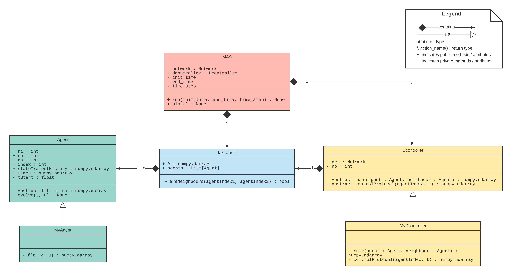

# pyMAS

A python package to simulate dynamic multi-agent systems (or networked control systems).
This package is designed to help study the effects of faults and cyber-attacks on a MAS.

## Multi-Agent Systems

In simple words, multi-agent system (MAS) are complex distributed systems that can be 
broken down into subsystems (agents) interacting with each other.
This interaction can be physical, such as input-output interaction between agents, or it can be 
the use of information exchanged via information and communication technology (ICT). The latter is 
in fact a subset of a larger class of systems in systems and control community called 
"networked control systems".

The interconnection topology between agents can be represented by directed graphs. The graph edges show 
the information flow between agents, while the graph nodes represent agents.

In this projects, each agent $i$ is considered as continuous-time dynamical systems of the general form 

$$
\dot{x}_i(t) = f(x_i(t),u_i(t),t)
\tag{1}
$$

where $x_i(t)$ is the state vector, $u_i(t)$ is the control input of agent $i$. The control input 
can be designed in a distributed way using the information received from the neighboring agents of 
the agent $i$.

### Consensus in MASs

The consensus in MASs is reffered to the problem where it is desired for all agents to reach at the same 
value for some variables (states) at some point in time. As an example, in a homogenous MAS of $n$ agents 
of order one (integrator agents), i.e.,

$$
\dot{x}_i(t) = u_i(t)
$$

the following control law can solve the consensus problem

$$
u_i(t) = \sum_{j\in \mathcal{N}_i}^{} \big(x_j(t) - x_i(t)\big)
$$

where $\mathcal{N}_i$ is the set of agent $i$'s neighboring agents.

For more information on MAS and consensus on graphs, please reffer to [1] and references therein.

## Usage

In order to simulate a MAS with arbitrary dynamics for each agent, the function in (1) should be 
implemented. For instance, to implement an agent with first-order dynamics we can write:

```python
from pymas.agent import Agent

# Create my custom Agent class called MyAgent
class MyAgent(Agent):
    
    def __init__(self, ni=1, no=1, ns=2, f=None, *, tStart=0, \
                 init_states=None, index: int=None):
        Agent.__init__(self, ni, no, ns, f, tStart=tStart, \
                       init_states=init_states, index=index)
    
    # My custom dynamics: Single integrator: x_dot(t) = u(t) => f = u
    def f(self, t, x, u):
        return u
    
    def output(self):
        return
```

The agents connection can be defined by defining the network's adjacency matrix as follows:

```python
from pymas.network import Network

# Create an instance of Network with intended topology:
#   - Define Adjacancy matrix:
A = np.array([[0, 1, 1, 0, 0, 0], 
              [1, 0, 1, 1, 0, 1], 
              [1, 1, 0, 0, 1, 0],
              [0, 1, 0, 0, 0, 1],
              [0, 0, 1, 0, 0, 1],
              [0, 1, 0, 1, 1, 0]]) 
#   - Create the network instance:
net = Network(A, listOfAgents)
```

To implement a distributed control law, one can write the following:

```python
from pymas.dcontroller import Dcontroller

# Create a custom distributed control strategy by implementing Dcontroller methods:
class MyDcontroller(Dcontroller):
    
    def __init__(self, net: Network):
        Dcontroller.__init__(self, net)
    
    def rule(self, agent, neighbour):
        return neighbour.stateTrajectHistory[-1] - agent.stateTrajectHistory[-1]
    
    def controlProtocol(self, agentIndex: int,  t): # Simple sigma protocol
        # # DEBUG:
        # print("For agent ", agentIndex, "-- t: ", t)
        
        # # if t == 0 then return zero output vector (since u(0) is 0):
        # if t == self.net.agents[agentIndex].tStart:
        #     return np.zeros(shape=(self.ni, 1))
        # Calculate the control input of "agentIndex"-th agent:
        u = np.zeros(shape=(self.ni, ))
        for a in self.net.agents:
            if self.net.areNeighbours(a.index, agentIndex):
                u += self.rule(self.net.agents[agentIndex], a)
        return u

# Create the Dcontroller instance:
dcont = MyDcontroller(net=net)
```

And finally, in order to run a simulation with the defined MAS, one can use `mas.run()` method:

```python
from pymas import mas

# Create a MAS instance
mas = mas.MAS(network=net, dcontroller=dcont)

# Run the simulation from t=0 to t=15 with step size of 0.05 [sec].
mas.run(0, 15, 0.05)
```
## Examples

There are three examples ``, ``, and `` for , respectively. The results of these three examples are 
plotted below.


## UML Class Diagram



## Bibliography

[1] R. Olfati-Saber, J. A. Fax and R. M. Murray, "Consensus and Cooperation in Networked Multi-Agent Systems," in *Proceedings of the IEEE*, vol. 95, no. 1, pp. 215-233, Jan. 2007, doi: 10.1109/JPROC.2006.887293.